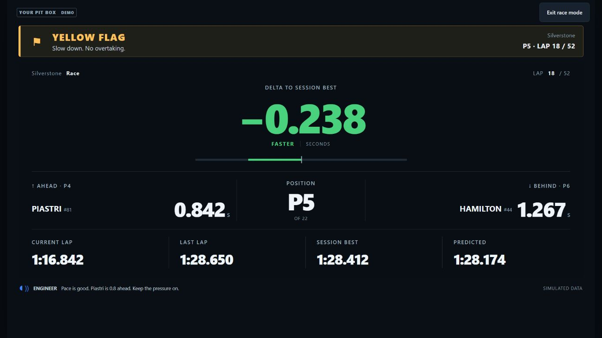
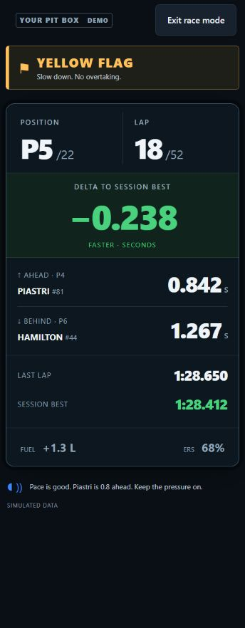

# Your Pit Box 4.11.0 — release verification

Windows/shared version 4.11.0; Android revision 18. Both application artifacts
were built from `661acf537bc6328c692970e4ea7f0710dff243af`.
Status: **published and verified** on 18 September 2026 UTC (17 September US
Eastern), at [yourpitbox.com](https://yourpitbox.com/#download).

## Driver Dashboard

The new tab provides Cockpit, Race Focus, Battle, Endurance, My Layout and Phone
layouts. It shares the parent application's current telemetry stream. Auto display
profiles use CSS viewport size and touch capability and update on resizing or
rotation. Manual Fold, Galaxy Tab, iPad and laptop profiles remain available.
They are layout presets, not claims of exact hardware identification.

Flags have explicit priorities. Lost telemetry removes racing values; stale
session or status packets cannot produce a green race-control indication. Missing
RPM and other unsupported fields stay unavailable. Rival gaps represent race
order, not physical on-track proximity. Lap predictions label their PB or
session-best reference. Customization preserves card order, visibility, units,
number size, contrast and keyboard focus during updates.

## Automated and packaged checks

- [Windows CI 35299771435](https://github.com/scottsart1/Pit-box/actions/runs/35299771435)
  passed: **1,830 Python tests, 1 skip**, actual installer lifecycle, frozen
  startup, 25-lap synthetic UDP race, database integrity, restart/persistence,
  shutdown and uninstall with data retention.
- [Android CI 35299770067](https://github.com/scottsart1/Pit-box/actions/runs/35299770067)
  passed: **1,570 Python tests**, **23 dashboard Node tests**, **62 Worker Node
  tests**, native packaging and emulator startup/UDP/restart/background checks.
- Final website version/checksum changes passed **77 Python tests** locally.
  The corresponding Worker release reference passed **62 Node tests**.
- The frozen Windows build received, parsed and recorded all **18,604**
  independently counted full-field packets, with zero rejects, internal drops,
  recording errors or 3-second request timeouts. Health P95 was 0.328 s,
  max 1.891 s; state P95 0.422 s, max 0.688 s. SQLite and shutdown gates passed.
- The installed Windows 25-lap fixture completed in 111.593 seconds, received
  final classification and retained the completed race. Combined request P95
  was 1.735 s and max 2.094 s. This is accelerated synthetic-race evidence.

An initial local full-suite run overlapped a version update: 1,825 passed,
five version/cache-reference failures and one skip. Fresh-process version/UI/
Android/signing checks passed (55 tests), followed by the clean final CI runs
above. Old website checksum assertions were updated to the verified new artifacts;
the final website suite passed. Failed attempts are not counted as passing checks.

## Browser and physical-screen checks

The six layouts were checked across Fold cover (344×882), Fold open (690×829),
iPad mini (744×1133), iPad/Air (820×1180), Galaxy Tab (800×1280), large iPad
(1024×1366), laptop (1366×768), and desktop (1920×1080) browser viewports.
Card-clipping issues in Battle and narrow My Layout were fixed and retested.
Manual profile persistence, hidden-card reordering, keyboard focus, large numbers,
high contrast, flag scenarios and telemetry loss were exercised. Browser checks
reported no JavaScript errors. The embedded app received live synthetic race data
through the parent bridge, including driver positions, rivals and resource values.

Fold landscape (829×690) and phone landscape (844×390) were checked in race mode.
On a short phone display, secondary rows can scroll; all layouts do not promise
every metric on one screen. The public demo and self-contained HTML rendered and
their controls worked. Fold and iPad coverage is browser viewport testing, not
physical hardware testing.

The signed, non-debuggable QA app was updated on a physical Samsung SM-X930
tablet with Android 16, retaining existing app data. The dashboard automatically
selected Tablet at an observed 1691×879 CSS-pixel viewport. The new tab and all
layout controls rendered clearly, and keyboard activation of Race mode hid the
configuration controls while retaining the prominent telemetry-status banner.
The Customize dialog opened with all settings and its Done button visible.
No live packets were arriving during this physical UI check. Live reception for
this release is covered by the emulator and Windows/browser fixture tests above;
this check does not claim physical tablet Wi-Fi reception or a full race.

## Artifacts and distribution boundaries

| Artifact | Bytes | SHA-256 |
| --- | ---: | --- |
| `PitWall-Setup.exe` | 34,709,580 | `c98eeaad90056b0eb8b538e6846c43ec05ce0c94e5eba9efaea3589e22302159` |
| `YourPitBox-4.11.0-android.18.apk` | 72,775,518 | `ab56cd50dac845d3ff99bdea329934f149bf45c16cc08091a353e8fe3c55d1fe` |
| `YourPitBox-Driver-Dashboard.zip` | 28,262 | `28087209d7dfc9bf473f9097e1b976110dbc4841cf02e94861a17c3625fffe67` |

The standard and isolated QA Android APKs verify with v2/v3 signatures and the
existing release certificate SHA-256
`20c2751e5c0ede43a2442331336b990433e53d9e512f3f1bca3e8d5bee4c6983`.
Their 73 engine/native/static payload entries are identical. Windows remains
unsigned for the existing direct website distribution, with the published
checksum and installer notice. Android retains its existing 4 KiB page-size
restriction. Provider audio, hardware folding and long-duration background
reception are outside this release's dashboard checks.

The [public demo](https://your-pit-box-driver-dashboard.sarthakvij123450.chatgpt.site/)
uses labelled sample data. Its
[offline ZIP](https://your-pit-box-driver-dashboard.sarthakvij123450.chatgpt.site/downloads/YourPitBox-Driver-Dashboard.zip)
contains a self-contained HTML dashboard and opening instructions. The anonymous
public ZIP was verified byte-for-byte; its HTML equals the locally built artifact.
Live telemetry is available in the installed application.

## Publication record

Public demo deployment `appgdep_6aaca482d3f48191b2314698b9e8aa84` succeeded on
18 September 2026 UTC, from source `25baa45f3adf2bee62ba561c8953bbe9dcfea24e`.
Its access is public. The application website and download publication receipt
is recorded below.

- Existing Cloudflare Pages project `pitwall`, production branch `main`:
  [deployment 8cf6f3c1](https://8cf6f3c1.pitwall-2k7.pages.dev), serving
  [yourpitbox.com](https://yourpitbox.com/). It includes the release section,
  application checksums and direct public-demo/offline-ZIP links.
- Existing `pitwall-activation` Worker version
  `1977689f-61ff-4b6d-8ec3-c4ac12bc44e0` serves Android revision 18. Existing
  database bindings, credentials, rate limits and retention trigger were retained;
  no database migration was required.
- R2 contains `YourPitBox-4.11.0-android.18.apk`, immutable Windows backup
  `releases/windows/4.11.0/PitWall-Setup-c98eeaad.exe`, and current Windows
  object `PitWall-Setup.exe`. Earlier versioned release objects were retained.
- Anonymous public verification hashed **every byte** of both application
  downloads, matching the sizes and SHA-256 values above. HEAD returned the
  correct MIME type, filename and length. Full and short range requests returned
  206 with correct byte ranges. These checks used ranges to avoid adding test
  download-start events. `installer-info` reports `needs_code: false`.
- The custom-domain HTML passed checks for both versions, both checksums and
  the offline ZIP link. Served CSS and download/review JavaScript matched the
  built files exactly. HTML is checked for content rather than claiming byte
  equality after hosting transforms. Browser inspection confirmed the final
  release section and its public/offline links render correctly.

Local evidence is retained in `driver-dashboard-release` beside the production
worktree: public download and website verification JSON, signed APKs, installer,
CI smoke/counting evidence, and physical tablet UI screenshots. The public demo
source is stored separately from application source; both serve the dashboard
code built and tested for this release.
